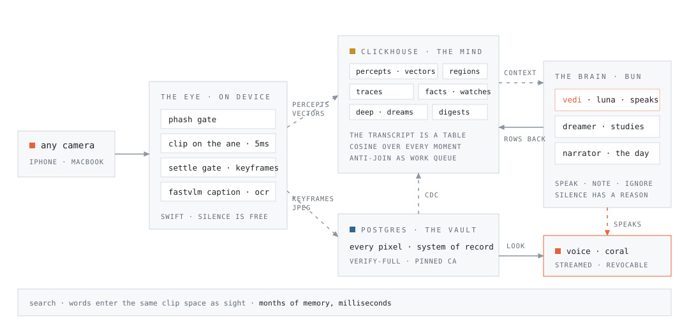

<p align="center">
  <picture>
    <source media="(prefers-color-scheme: dark)" srcset="brand/vedi-wordmark-dark.svg">
    
  </picture>
</p>

<p align="center"><strong>vedi</strong>, eyes and visual memory, as an agent.</p>

<p align="center">
  
  
  
</p>

Blind people have memory. They have never had visual memory. Every assistive
tool on the market shows the present, a snapshot, and then it is gone. Vedi
watches through any camera, decides what deserves words, says them in a warm
voice, and keeps everything she has ever seen in a database you can ask,
search, and scrub: the visual memory her person never had.

She is not the cane and not the guide dog. She is the meaning and the memory.
The dog walks you; Vedi tells you what things mean and remembers where you
have been.

## A day with her

Real transcript, one day, one phone held in a hand:

> "You're inside BS Chicken, with three people nearby. The sign calls it
> Korean traditional chicken."

> "You're eating a meal with rice, vegetables, and meat, chopsticks in hand.
> Your jacket still says CHEEMA." *(twenty seconds later)* "You've switched
> to a plastic fork, but you're still eating the same meal."

> "That's a wonderfully odd title, 'Gallery of Tofu Masterpieces.' The
> little tofu faces are charming."

> Asked to watch for a dog, hours earlier, told her owner's name once:
> "You're back in view, Cheema. Still no dog, just you."

> "Tell me about my day" gets a story, not a list, because a narrator has
> been writing it all along. And "when did I last see the laptop covered in
> stickers?" comes back "around 10:49 this morning," found by meaning, not
> keywords.

<p align="center">
  <picture>
    <source media="(prefers-color-scheme: dark)" srcset="brand/vedi-flow-dark.svg">
    
  </picture>
</p>

## Product law

1. The agent never ingests images. Pixels stop at the perception layer; a
   deliberate `look` fetches one frame through a stateless vision call and
   only words come back.
2. Everything seen becomes durable rows the agent receives on its next turn.
3. Silence is free. A stable scene costs zero tokens and near-zero compute.
4. The memory is the intelligence; the brain is small and swappable.
5. Every utterance anchors the frames that justify it, and every silence
   is written down with its reason.

## How she thinks

Three agents, each defined in a single markdown file under `brain/agents/`:
frontmatter names the model and tools, the body is the prompt. Only Vedi
has a mouth.

**Vedi (the conscious mind)** decides every utterance on a small fast model:
speak, note, or ignore, with a why and evidence, in about two seconds. Her
context is layered like skills: identity, ambient blocks refreshed each turn
(clock, known people, today's story, active watches, the state of her own
mouth), a bounded working set, and tools that load depth on demand.

**The dreamer (the subconscious)** studies every kept frame chronologically,
about thirty seconds behind life, each dream reading the written thread of
the moments before it, so memory accumulates instead of fragmenting. It
finds its work with an anti-join: frames with no deep row yet. The row's
existence is the processed mark, so a crash self-heals and nothing is ever
double-studied. When vectors prove a frame unchanged from the last studied
moment (threshold 0.95, measured over 730 consecutive keyframe pairs), it
records a continuation without paying a model. Identity claims carry their
evidence, and unknown people become open threads the narrator surfaces, so
she can ask "who is this?", remember the answer, and know them forever.

**The narrator (the autobiographer)** folds each day into a story: places,
people, moments, open questions. The digest rides ambiently in her context,
which is why "tell me about my day" needs no lookup at all.

## Architecture

| ClickHouse, the mind | Postgres, the vault |
| --- | --- |
| the transcript is a table: no session store exists, a restart rebuilds her working set from `traces` | every pixel, the system of record, served through the Brain |
| a 512-float CLIP vector on every kept frame; cosine over months of memory in milliseconds, for the human's CMD-K and the agent's own `search_memory` alike | TLS is verify-full against the service's pinned CA |
| the dreamer's work queue is an anti-join; the narrator's day is a `ReplacingMergeTree` row replaced whole on every fold | native CDC mirrors frame metadata into the mind every 60s, jpegs excluded by law 1 |
| facts, watches, and digests mutate by inserting newer versions, never by updating | a write-through hot cache serves the freshest frames from memory; history reads hit the vault |
| standing watches probe new percepts every 20s with a cosine threshold, shaped for the QueryRunner engine landing in 26.7 | the `look` tool fetches one frame on demand for a stateless vision read |
| ASOF joins stitch every search hit to the nearest kept frame | |

## The voice lives in the present

Replies stream sentence by sentence into TTS with the next sentence's audio
prefetched, so she starts speaking while still writing. Proactive lines are
revocable: at most one unstarted line waits, a newer decision replaces it,
and the judgment layer is told when its own mouth is busy, so pacing is a
decision with a reason, not a rule. The lineage runs through Levelt's
self-repair model, incremental-unit dialogue systems, and the RoboCup
sportscasters, with one advantage none of them had: nothing skipped is
lost, because every moment is already in the database.

## The surface

A full-bleed stage with broadcast captions, a reel of what she keeps, a
transcript where silences fold into quiet ticks with receipts, and the
brain: every remembered moment as a point in CLIP space, regions she named
herself, a day scrub that replays the galaxy growing from empty. CMD-K
searches by meaning and ignites the matches; the same search is her tool
when you ask out loud.

## Run it

macOS on Apple Silicon for the Eye; the Brain and surface run anywhere Bun
does. Secrets live in `.env.local` at the repo root: `CLICKHOUSE_HOST`,
`CLICKHOUSE_PORT`, `CLICKHOUSE_USER`, `CLICKHOUSE_PASSWORD`,
`POSTGRES_URL`, `OPENAI_API_KEY`. Model weights (MobileCLIP-S2, FastVLM
0.5B) live under `eye/Models/`, gitignored.

The short way, once dependencies are installed:

```console
./demo mac       # everything up, eyes on the MacBook
./demo phone     # everything up, eyes on the iPhone
./demo status    # one-glance health
./demo down      # end of day
```

A supervisor restarts anything that dies. The long way:

```console
# the eye
cd eye
xcodebuild -scheme VediEye -destination 'platform=macOS' -derivedDataPath .xcodebuild build
./.xcodebuild/Build/Products/Debug/VediEye --watch --loop      # --device "iPhone" for a phone

# the brain
cd brain && bun install && bun run src/server.ts

# the surface
cd web && bun install && bun dev
```

Open `localhost:3000`. Talk by holding space, or toggle the open mic and
just speak.

---

Built for ClickHouse's Better Days hackathon, Japantown, San Francisco.
